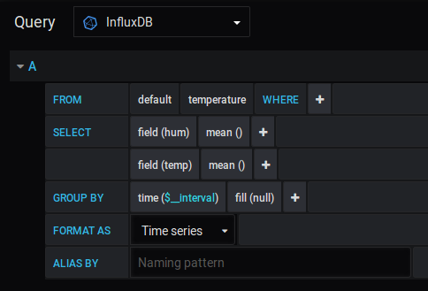

# Raspberry DHT11 Project

#This project read the value on DHT11 sensor and send the value to remove server database.

# Requirments
 - Raspberry Pi
 - DHT11 Sensor
 - Grove Pi Shield
 - Docker
 - Influxdb Image (for Docker)
 - Grafana Image (for Docker)

# Setup
Fisrt install Grovepi lib. on raspberry
```
curl -kL dexterindustries.com/update_grovepi | bash
cd Firmware bash 
firmware_update.sh
reboot
```
Check the Grove Pi ports
```
sudo i2cdetect -y 1
```
Sensor on the D4 port
```
 0  1  2  3  4  5  6  7  8  9  a  b  c  d  e  f
 00:      -- 04 -- -- -- -- -- -- -- -- -- -- -- 
 10: -- -- -- -- -- -- -- -- -- -- -- -- -- -- -- -- 
 20: -- -- -- -- -- -- -- -- -- -- -- -- -- -- -- -- 
 30: -- -- -- -- -- -- -- -- -- -- -- -- -- -- -- -- 
 40: -- -- -- -- -- -- -- -- -- -- -- -- -- -- -- -- 
 50: -- -- -- -- -- -- -- -- -- -- -- -- -- -- -- -- 
 60: -- -- -- -- -- -- -- -- -- -- -- -- -- -- -- -- 
 70: -- -- -- -- -- -- -- -- 
 ```
 Clone the git repo
 ```
 git clone https://github.com/evrenkorkmaz/raspberry-dht11-project.git
 ```
 
 
 
 Install Docker ( on Rasbppery or Remote Server)
 
 ```
sudo apt-get update
sudo apt-get install docker.io docker-compose
sudo systemctl start docker

```
# Automaticly Pull and Run Influxdb and Grafana
If u use Remote sever for Docker, clone the repo 
 ```
 git clone https://github.com/evrenkorkmaz/raspberry-dht11-project.git
 ```
Run this command for grafana volume.
```
  sudo mkdir -p /srv/docker/grafana/data
  chown 472:472 /srv/docker/grafana/data
  ```

 Run this command in docker-compose.yml directory
  ```
  sudo docker-compose up -d
  ```
 # Manuel: Pull and Run Influxdb (Port 8083 - Web Page -- Port 8086 - Influxdb API )

```
sudo docker pull influxdb
sudo docker run -d -p 8083:8083 -p 8086:8086  influxdb
```
Check the Influxdb Web Page On 8083 Port 
```
http://influxdb.server.ip.address:8083
```
Pull and Run Grafana 
```
sudo docker pull grafana/grafana
sudo docker run -d -p 3000:3000 grafana/grafana
```
Check the Grafana Web Page On 3000 Port 
```
http://grafana.server.ip.address:3000
```
Default User: admin Passwd: admin


Create a Database on Influxdb 
```
Query: CREATE DATABASE "db-name"
```

Now start the temp.sh Script on Raspberry Pi
But First check on the Script
In the curl line must the add your Influxdb databse ip adresses and databse name 

```
curl -i -XPOST "http://xxx.xxx.xxx.xxx:8086/write?db=db_name" --data-binary @data.txt
```
 Should the check some value before run script
 ```python
# grovepi.dht
dht_sensor_port=4 # Add your sensor port 
dht_sensor_type=0 # sensor type DHT11-> 0 DHT22-> 1

# create a user on ipinfo.io for location information
# when sign in ipinfo take a access token for your user.
access_token = '12345678987654'
ip_address = 'xx.xx.xx.xx' #your local ip

# smtp
# this program send a mail for some temp or hum value
# Because of first define a sender and destination mail information
sender_mail='sender-mail@gmail.com'
sender_mail_passwd='sender-passwd'
destination_mail='dest-mail@gmail.com'

#alarm
# define a max and min values
max_temp=25
min_temp=15
max_hum=35
min_hum=15
 ```
 And then Start temp.sh Script
  ```
  ./temp.sh
   ```
 For the background 
  ```
  ./temp.sh >&/dev/null &
  ```
 Now create a panel for the graph on Grafana
  ```
  http://grafana.server.ip.address:3000
  ```
 Default User: admin Passwd: admin
 Fisrt step click"Add Data Source" and select Influxdb and define Influxdb databse api link (http://influxdb.server.ip.address:8086) and databse name.
 Second step click "New Dashboard" and than click "Add panel" and "Add Query".
 Change the settings like that and save.
 
 
 
 
 
 
 
 
 
 
 
 
 
 
 
 
 
 
 
 
 
 
 
 
 
 
 
 
